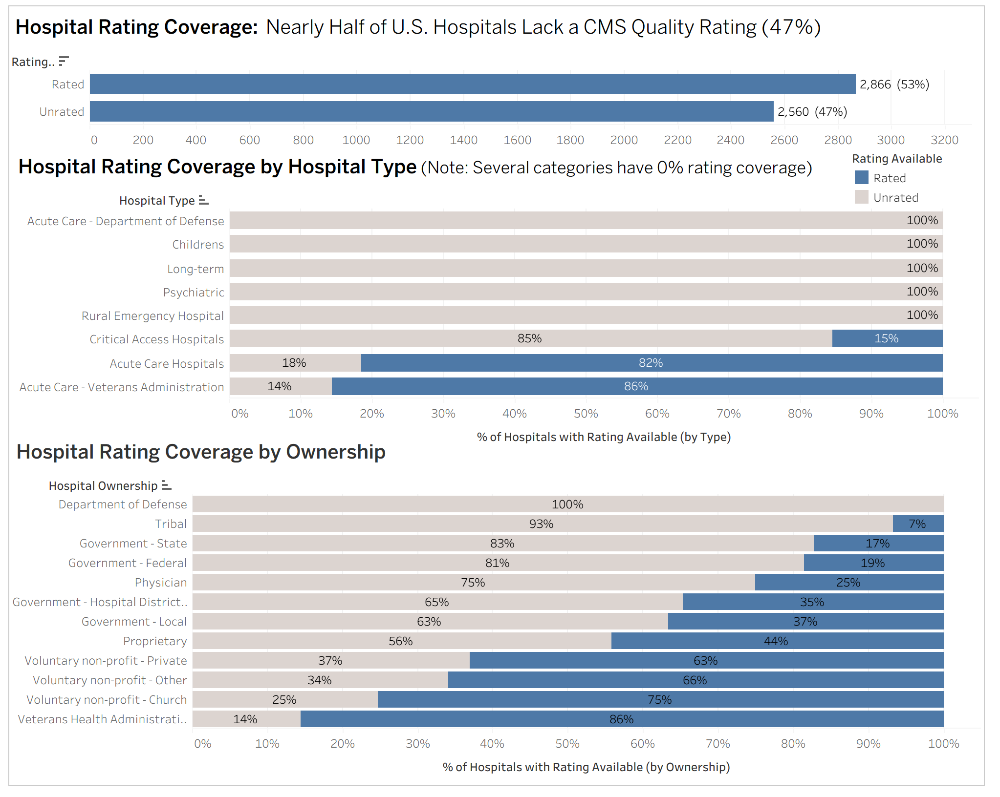
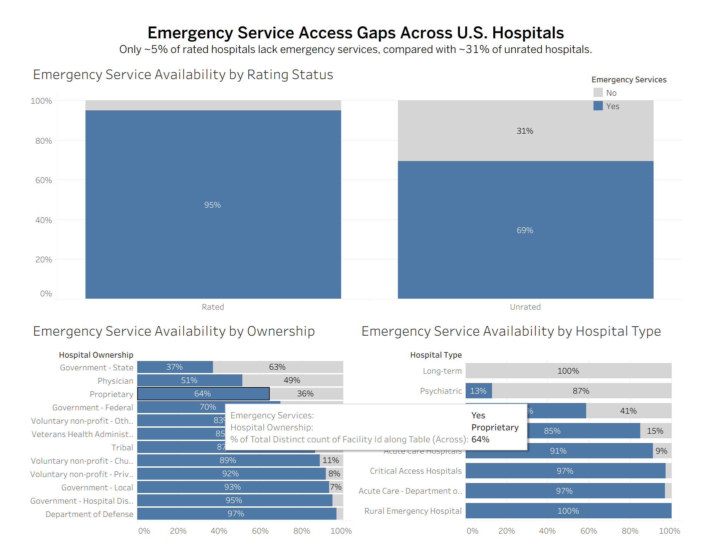
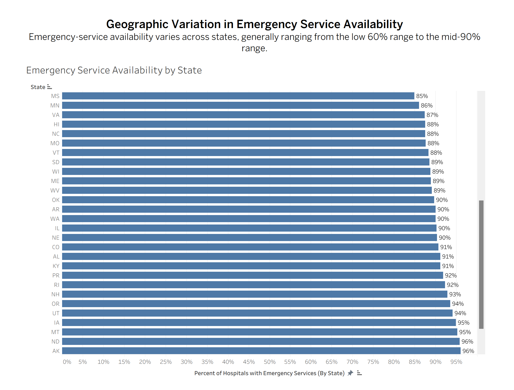

# U.S. Hospital Rating Coverage and Emergency Service Access Analysis

This project analyzes the CMS Hospital General Information dataset to examine **gaps in hospital rating coverage** and how **emergency-service availability varies across hospital types, ownership structures, and geographic regions**.

Rather than ranking hospital quality, this project focuses on **where ratings are missing and how access to emergency services differs across the U.S. healthcare system**.

Tableau Link: https://public.tableau.com/app/profile/gurbaj.singh6229/viz/U_S_HospitalRatingCoverageandEmergencyServiceAccessAnalysis/RatingCoverageGap#1
---

## Project Overview

Nearly half of U.S. hospitals in the CMS dataset do not have an overall quality rating. This raises important questions about:

- where rating coverage is incomplete  
- whether certain hospital categories are systematically underrepresented  
- how emergency-service availability differs across rated and unrated hospitals  

This project explores these questions through **descriptive data analysis**, emphasizing structural differences in reporting and access rather than causal conclusions.

---

## Key Findings

- Nearly half of the 5,426 hospitals in the dataset do not have a CMS overall quality rating, with 53% rated (2,866) and 47% unrated (2,560).  
- One of the clearest findings in the dataset is the gap in emergency-service availability between rated and unrated hospitals: only 4% of rated hospitals do not provide emergency services, compared with 30.66% of unrated hospitals.  
- Rating coverage varies sharply by hospital type. Psychiatric, Children’s, Rural Emergency, and Department of Defense Acute Care hospitals had no reported ratings, while only 15% of Critical Access Hospitals were rated compared with 82% of Acute Care Hospitals and 86% of Veterans Acute Care hospitals.  
- Emergency-service availability also differs across ownership structures. State-government and physician-owned hospitals showed notably lower emergency-service coverage, while local-government and hospital district-owned facilities were among the highest.  
- Emergency-service availability varies significantly by hospital category. Critical Access Hospitals consistently showed very high emergency-service availability, physician-owned hospitals were much lower, and psychiatric facilities had the lowest availability overall.  
- State-level emergency-service availability showed visible variation, with some states near 60% and others in the mid-90% range, though these differences should be interpreted cautiously because hospital counts vary across states.  

---

## Dataset

**Source:** CMS Hospital General Information Dataset  

The dataset contains information on over 5,400 U.S. hospitals, including:

- Facility ID (unique identifier)  
- Hospital name and location (city, state)  
- Hospital type  
- Hospital ownership  
- Emergency service availability  
- CMS overall hospital rating  
- Rating footnotes  

A derived field (`rating_available`) was created to distinguish between rated and unrated hospitals.

---

## Methodology

## Tools Used

- **Python (Pandas)** — data cleaning and preprocessing  
- **MySQL** — structured data analysis and aggregation  
- **Tableau** — data visualization and dashboard development  
- **Git & GitHub** — version control and project organization  

### Data Cleaning (Python)
- Selected relevant columns from raw dataset  
- Standardized column names  
- Converted rating field to numeric  
- Created `rating_available` indicator  
- Handled missing values consistently  

---

### Data Analysis (SQL – MySQL)
- Aggregated rating coverage across hospital types and ownership groups  
- Calculated emergency-service availability rates  
- Compared rated vs unrated hospitals  
- Applied filtering (e.g., 50 U.S. states only for geographic analysis)  
- Used thresholds to remove small, noisy segments where appropriate  

---

### Data Visualization (Tableau)
- Built dashboards to highlight key findings  
- Focused on clear comparisons and segmentation  
- Avoided overloading visuals with unnecessary detail  

---

## Analysis Breakdown

### 1. Rating Coverage
- Overall rating availability across all hospitals  
- Coverage differences by hospital type  

---

### 2. Emergency Service Access
- Comparison of emergency-service availability between rated and unrated hospitals  
- Differences across ownership structures and hospital categories  

---

### 3. Geographic Variation
- State-level differences in emergency-service availability  
- Interpreted with caution due to variation in hospital counts  

---

## Tableau Dashboards

### Dashboard 1 — Rating Coverage Gap

*Rating coverage varies significantly across hospital types, with several categories showing no reported ratings.*

---

### Dashboard 2 — Emergency Service Access

*Unrated hospitals are substantially less likely to provide emergency services compared to rated hospitals.*

---

### Dashboard 3 — Geographic Variation

*Emergency-service availability varies across states, though differences should be interpreted cautiously due to varying hospital counts.*

## Repository Structure

sql/

├── 01_coverage_baseline.sql

├── 02_state_rating_coverage.sql

├── 03_type_rating_coverage.sql

├── 04_ownership_rating_coverage.sql

├── 05_emergency_baseline.sql

├── 06_state_emergency_coverage.sql

├── 07_rating_status_emergency_comparison.sql

├── 08_ownership_emergency_coverage.sql

├── 09_type_ownership_emergency_matrix.sql

├── 10_weakest_emergency_segments.sql

outputs/

├── q1_coverage_summary.csv

├── q2_state_rating_coverage.csv

├── q3_type_rating_coverage.csv

├── q4_ownership_rating_coverage.csv

├── q5_emergency_baseline.csv

├── q6_state_emergency_coverage.csv

├── q7_rating_status_emergency_comparison.csv

├── q8_ownership_emergency_coverage.csv

├── q9_type_ownership_emergency_matrix.csv

├── q10_weakest_emergency_segments.csv

visuals/

├── dashboard_1_rating_coverage.png

├── dashboard_2_emergency_access.png

├── dashboard_3_geographic_variation.png

notebooks/

├── data_cleaning.ipynb

src/

├── __init__.py

├── config.py

├── export_to_mysql.py

---

## Important Notes & Limitations

- This project is **descriptive**, not causal. It does not claim that missing ratings cause differences in emergency-service availability.  
- Some hospital types (e.g., psychiatric, Department of Defense) may not receive standard CMS ratings due to reporting criteria.  
- Emergency-service availability differences may reflect **hospital specialization**, not performance.  
- State-level comparisons should be interpreted cautiously due to differences in the number of hospitals per state.  

---

## How to Reproduce

1. Load dataset into Python and perform cleaning  
2. Import cleaned data into MySQL  
3. Run SQL scripts in order  
4. Export outputs and connect to Tableau  
5. Build dashboards based on analysis outputs  